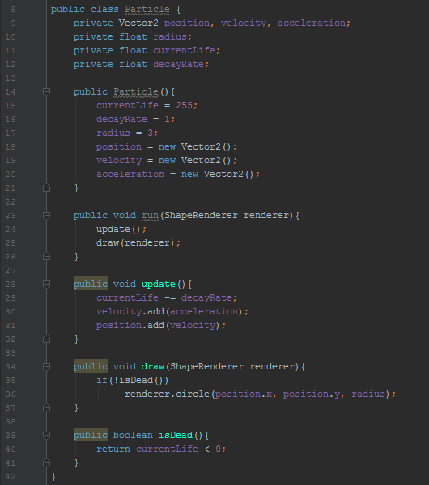
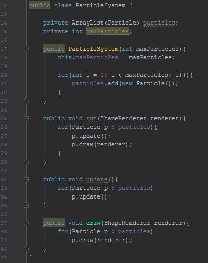
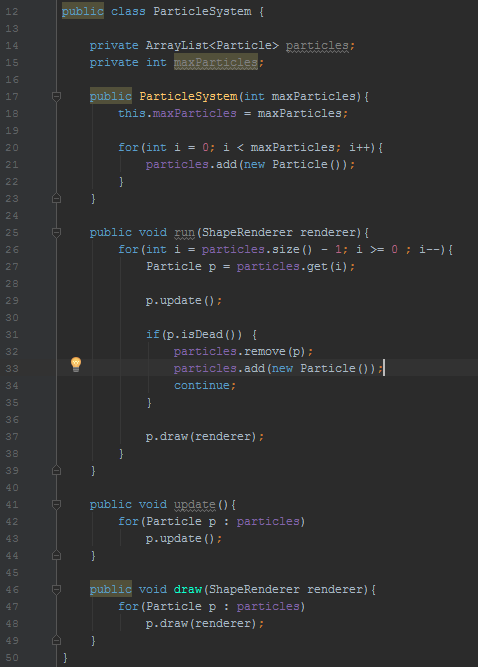
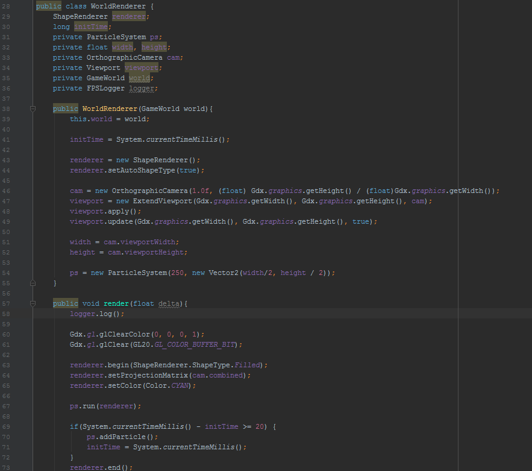
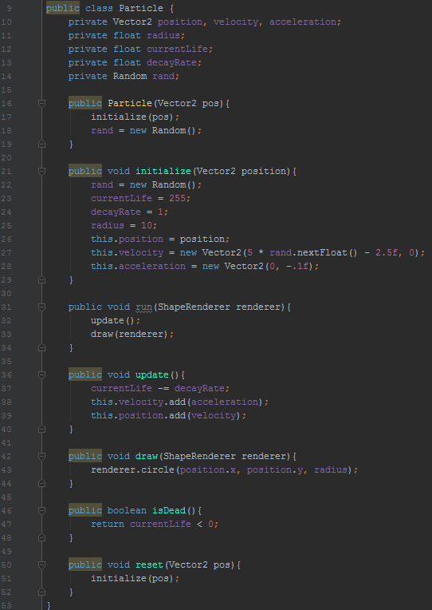
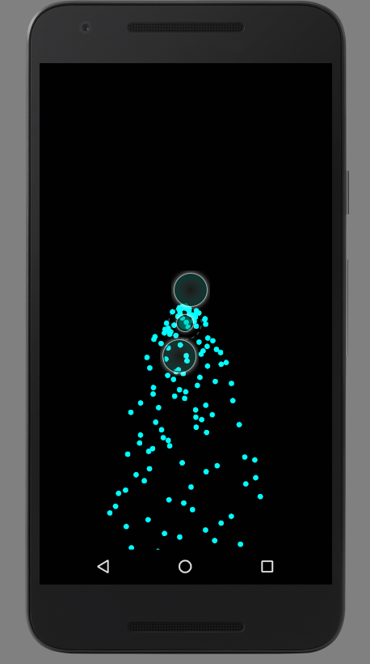
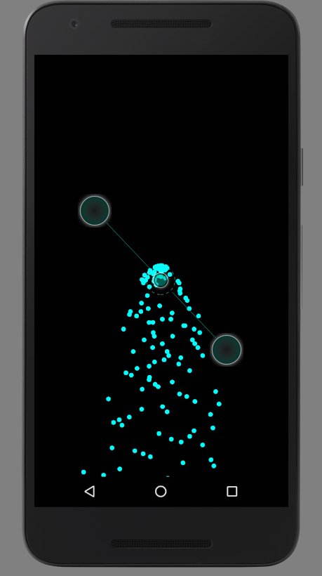

**How to Make a Simple Particle System**

The first thing we need to do is understand what a particle system really is. It's a fairly general term that is thrown around by a lot of people, but its meaning is not particularly well-understood. Essentially, a particle system is a manager that handles large amounts of particles at once. Particles are simply objects, stereotypically circles, which move around the screen in a manner specified by the particle system.
How do we even start making something so general? Well, a good first step would be to make a particle class and think about what types of functions and private variables it should have. Here is a fairly basic setup for our initial particle class: 

This is all fairly self-explanatory. We want our particle to have a position, velocity, and probably an acceleration to make it more dynamic. Whenever we decide to update this particle, we change its velocity by the acceleration, and the position by the velocity. None of this really does us much good if we can't even display this particle on the screen, so let's do that. 

So far, our particle can be updated and drawn. Since these two functions are almost always going to be used in conjunction with one another, I created the **run** function which simply calls both at once. The problem now is that when we eventually start adding particles to a particle system, if we continuously add particles but never remove them, we will end up having tens of thousands of particles to update every frame, which will obviously cause some substantial lag. To fix that, let's add a way of controlling how long a particle is on screen for.

Now, our particle has two more attributes: **currentLife** and **decayRate**. These two variables control how long the particle is active for. Every frame, the particle's **currentLife** will be reduced by its **decayRate**. The particle will stop being drawn if its **currentLife** is below 0. To accomplish this, I simply added the function **isDead()** which returns [currentLife < 0].
This is all well and good, but we haven't really started making a particle system yet, we've just been focusing on the individual particles, which is fine, but we will run into some issues if we neglect making the system for too long. Let's make a simple **Particle System** class which can control the behaviors of all particles in an array.

This may look like a lot, but it's not much different than what we had before. The **ParticleSystem** class only has one argument in its constructor which essentially decides how many particles we want it to have. Its other functions our analagous to those of our regular **Particle** class, except they apply themselves to every particle in the **particles** array. 
There are just a few more things we need to do to make this thing working properly. Remember how I said we need a method of capping the number of particles on the screen? Well, although we are doing that by capping the size of our particle system, we were a little sloppy in making our **Particle** class. 

If we look at our method of stopping the particles from drawing, there is a subtle flaw. Although the particle is not being drawn to the screen after its **currentLife** is less than 0, the particle system still has to access the particle's update function even if it will never be drawn again. We can fix this by simply removing any "dead particles" from the particle system all together. 

Note that I iterate through the particles backwards now. The reason for this is that when an element is removed from an array, every element ahead of that removed one is pushed back to fill the gap. That means that when the index increments by 1, we are going to skip the particle that replaced the removed one. Here is a simple illustration of what happens: 

  ***Index:*** 0  1  ***2***  3  4       
***Element:*** a  b  c  d  e

Suppose we remove element c.

  ***Index:*** 0  1  2  ***3***

***Element:*** a  b  d  e

The bolded and italicized index represents what index of the array we are checking. As you can see, we never actually updated element d, because although our index increased, the position of all the elements in our array changed. So instead of checking element d, it checks the spot where element d **WAS** before the removal of element c. That is a relatively simple change, but it is important to note. 

The main change in this new code snippet is that whenever a particle is dead, we move it from the array and then add a new particle to it to make sure that the number of particles on the screen is constant. While this seems like that natural thing to do, it is somewhat inefficient. Why delete and create a particle when we can just reset it to its initial state? Although this doesn't really follow what we see visually, it makes more sense.

I've changed the **Particle** class constructor to call a different function to initialize it so that I can reinitialize it after it dies. I also added some actualy numbers for its position, velocity, and acceleration. At the moment, the position of the particle is an argument of the contructor, the velocity is some random vector whose x and y components are less than or equal to 5, and the acceleration is just a constant negative y value to simulate gravity. We can actually draw this to the screen now and see what kind of effect it will give us. Although the following snippet is very android-specific, I'm showing just in case it's not immediately obvious how we would draw the particle system. 

The only really noteworthy things in this code is that I've set the position of the particle system to the center of the screen and given it a cap of 250 particles, and I add a particle to the system every 20 milliseconds (since android measures time in milliseconds.)
All the drawing happens in the lower **render(float delta)** function.

Up to this point, the majority of all the code i've written is easily transferrable to any other language. That being said, if you've been following along line-for-line in java and libgdx, there are a few things I need to clear up. None of the logic really changes, but the way we need to write some of that logic out is a bit different. Here are the final **ParticleSystem** and **Particle** classes:

Here are a couple screenshots of what it looks like on an emulator (the two large circles are just artifacts that appear when screenshotting.)

With the way I defined the particle motion, the system has sort of a rain shower effect. However, this behavior is very easy to manipulate simply by changing how you define the velocity and acceleration of the particles. Note that this is nowhere near and optimized particle system, it is simply a functional one, so don't expect to run 30,000 particles at 60fps with this thing. For most intensive purposes however, this should be sufficient. 

